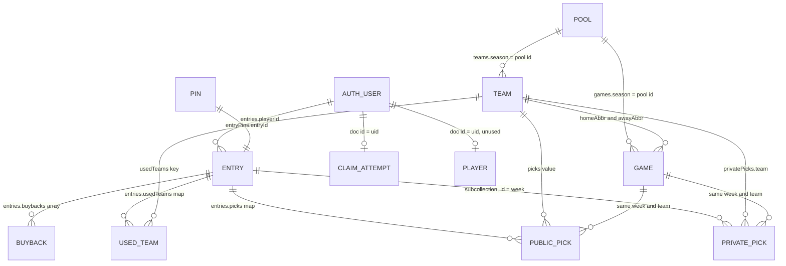

# Pool model cheat sheet

Season **2026**. Regular season, weeks **1–18**. One survivor entry picks one NFL team per week and cannot use that team again. Clients read Firestore. Writes go through Cloud Functions in `us-east4`, except an admin custom claim can also write under the security rules.

Swift types live in `DellaRoccaNFLPoolGrok/Models/` and `Session/PlayerSession.swift`. Document shapes live in `firebase/functions/src/`.

## Status

`EntryStatus`: `active` · `pendingBuyback` · `eliminated`

| Status | Meaning | Can pick? |
| --- | --- | --- |
| `active` | Alive | Yes, until that game kicks off |
| `pendingBuyback` | Lost in week 1–6 and is waiting on the commissioner | No |
| `eliminated` | Out | No |

A loss in week **1–6** sets `pendingBuyback`, `eliminatedWeek`, and `buybackDeclined: false`. A loss in week **7–18**, or a declined buyback, sets `eliminated` and `buybackDeclined: true`. The app calls `active` “Alive”.

`recordBuyback` puts the entry back to `active`, clears `eliminatedWeek`, appends a buyback, and increments `buybackCount`. `declineBuyback` sets `eliminated` and `buybackDeclined: true`.

## Pick rules

- Team abbreviation is 2–3 letters and must play in that week (`games.teams` contains it).
- The entry must be `active`, and the caller must own it. A commissioner can submit for any entry and can change a pick after kickoff.
- A team already stored in `usedTeams` or in `privatePicks` for another week is rejected.
- Changing the pick for the same week replaces the previous team.
- A missing pick when the week closes counts as a loss.
- A final game is a win only when the picked team’s score is **greater** than the opponent’s. A tie is a loss.
- Close week refuses to run while any game that week has a kickoff still in the future. `pool/2026.closedThroughWeek` advances only when every picked game is final.

## Who sees a pick

| When | Where it lives | Who can read it |
| --- | --- | --- |
| Before kickoff | `entries/{id}/privatePicks/{week}` | That entry’s player, and commissioners |
| After kickoff | Copied onto `entries/{id}.picks` and `.usedTeams`, then the private doc is deleted | Any signed-in user |

`publishLockedPicks` does that copy on the hourly season sync and again when a commissioner closes a week. The Pool tab shows a pick only after kickoff.

## Relationships

Firestore has no foreign keys. A relationship is a document id or a field that holds another document’s id. `picks`, `usedTeams`, and `buybacks` are stored inside the entry document. The diagram draws them as their own tables so the links are visible.

| From | To | How they join | What that means |
| --- | --- | --- | --- |
| `pool` | `teams` | `teams.season` = pool document id | One season has 32 teams |
| `pool` | `games` | `games.season` = pool document id | One season has every regular-season game |
| `teams` | `games` | `games.homeAbbr` and `games.awayAbbr` | Each game has two teams. Each team plays at most one game in a week |
| `auth user` | `entries` | `entries.playerId` = uid | One account can claim many entries. An entry has one owner, or none |
| `entryPins` | `entries` | `entryPins.entryId` = entry document id | One PIN identifies one entry |
| `auth user` | `claimAttempts` | document id = uid | One attempt counter per account |
| `auth user` | `players` | document id = uid | Defined in the rules. The app does not write it |
| `entries` | `privatePicks` | subcollection under the entry, document id = week | At most one hidden pick per entry per week |
| `entries` | `picks` | map inside the entry | At most one public team per week, written after kickoff |
| `entries` | `usedTeams` | map inside the entry | Each abbreviation points at the one week that entry used it |
| `entries` | `buybacks` | array inside the entry | One row for each week the entry bought back |
| `teams` | a pick | abbreviation equals `privatePicks.team`, a `picks` value, or a `usedTeams` key | The pick names a team |
| `games` | a pick | same `week`, and the team is `homeAbbr` or `awayAbbr` | The pick names a team that plays that week |

A public pick and the matching `usedTeams` row are written together, and the private pick for that week is deleted. Until kickoff, only the private row exists.

## Tables

Signed-in users can read `pool`, `teams`, `games`, and `entries`. `privatePicks` is owner-or-admin. `entryPins` and `claimAttempts` are not client-readable.

### `pool` — one document, id `2026`

| Column | Type | Key | Notes |
| --- | --- | --- | --- |
| document id | string | PK | The season, `2026` |
| `commissionerEmails` | string array | | Extra emails that may receive the admin claim |
| `oddsSyncedAt` | timestamp | | Spreads refresh when this is older than 12 hours |
| `closedThroughWeek` | number | | Last week closed with every picked game final |
| `updatedAt` | timestamp | | |

### `teams` — 32 documents, id is the abbreviation

| Column | Type | Key | Notes |
| --- | --- | --- | --- |
| `abbreviation` | string | PK | `BUF`, `KC`, `LAR`. Also the document id |
| `name` | string | | `Buffalo Bills` |
| `apiSportsId` | number | | API-Sports team id |
| `logoUrl` | string | | Shown on the pick button |
| `season` | number | FK → `pool` | `2026` |
| `updatedAt` | timestamp | | |

Palette colors live in `NFLTeam.all`, not in this table. Raiders, Steelers, and 49ers have two colors. Every other team has three.

### `games` — one document per regular-season game, id is `apiSportsId`

| Column | Type | Key | Notes |
| --- | --- | --- | --- |
| `apiSportsId` | number | PK | Also the document id |
| `season` | number | FK → `pool` | `2026` |
| `week` | number | | 1–18 |
| `homeAbbr` | string | FK → `teams` | |
| `awayAbbr` | string | FK → `teams` | |
| `homeName` | string | | |
| `awayName` | string | | |
| `teams` | string array | | `[homeAbbr, awayAbbr]`. Indexed with `season` and `week` |
| `kickoffAt` | timestamp | | Pick locks when this time is reached |
| `status` | string | | `scheduled`, `in_progress`, `final` |
| `homeScore` | number or null | | Filled when `status` is `final` |
| `awayScore` | number or null | | Filled when `status` is `final` |
| `spreadHome` | number | | Home-team spread. DraftKings first, then any US book |
| `oddsEventId` | string | | |
| `updatedAt` | timestamp | | |

API-Sports `FT` and `AOT` become `final`. `NS`, `TBD`, `PST`, `CANC`, and blank become `scheduled`. Anything else is `in_progress`.

`PoolGame` reads `week`, both abbreviations, `kickoffAt`, `status`, and `spreadHome`. The spread label is the home abbreviation plus the home number, rounded to the half point (`BUF -2.5`).

### `entries` — one document per pool entry

The client skips a document with no `label`. `ClaimedEntry` is this row in Swift. `canBuyBack` is `pendingBuyback`, not declined, and `eliminatedWeek <= 6`.

| Column | Type | Key | Notes |
| --- | --- | --- | --- |
| document id | string | PK | Entry id |
| `label` | string | | Name on the board |
| `status` | string | | `active`, `pendingBuyback`, `eliminated` |
| `playerId` | string | FK → auth uid | Empty until the PIN is claimed |
| `claimedAt` | timestamp | | Set by `claimEntry` |
| `picks` | map | | See the `picks` table. Public |
| `usedTeams` | map | | See the `usedTeams` table |
| `eliminatedWeek` | number or null | | Week of the current knockout |
| `buybackDeclined` | bool | | |
| `buybacks` | array | | See the `buybacks` table |
| `buybackCount` | number | | Length of `buybacks` after a grade or a recorded buyback |
| `gradedThroughWeek` | number | | Set by the importer grader, currently through week 3 |
| `updatedAt` | timestamp | | |

### `privatePicks` — subcollection `entries/{entryId}/privatePicks/{week}`

| Column | Type | Key | Notes |
| --- | --- | --- | --- |
| parent entry id | string | FK → `entries` | |
| document id | string | PK | The week, `"1"` … `"18"` |
| `week` | number | | Same week as the document id |
| `team` | string | FK → `teams` | Must play in `week` |
| `updatedAt` | timestamp | | |

### `picks` — map on the entry, one public team per week

| Column | Type | Key | Notes |
| --- | --- | --- | --- |
| entry id | string | FK → `entries` | The document that holds the map |
| week | string | PK with entry | Map key, `"1"` … `"18"` |
| team | string | FK → `teams` | Map value. Copied here at kickoff |

### `usedTeams` — map on the entry, one week per team

| Column | Type | Key | Notes |
| --- | --- | --- | --- |
| entry id | string | FK → `entries` | |
| team | string | PK with entry, FK → `teams` | Map key |
| week | number | | Map value. The week this entry used that team |

### `buybacks` — array on the entry

| Column | Type | Key | Notes |
| --- | --- | --- | --- |
| entry id | string | FK → `entries` | |
| `eliminatedWeek` | number | | The week that was bought back. Swift reads only this field |
| `recordedAt` | string | | ISO time. Written when a commissioner records the buyback |
| `boughtBackBeforeWeek` | number | | Written by the week 1–3 grader when a later public pick shows the entry continued |

### `entryPins` — one document per PIN

| Column | Type | Key | Notes |
| --- | --- | --- | --- |
| document id | string | PK | The PIN. One letter `A–Z` plus four digits from 1–9. `A1234` is valid. `A0123` is not |
| `entryId` | string | FK → `entries` | The entry this PIN claims |

Eight wrong attempts per account per hour. A PIN already owned by a different uid cannot be claimed again.

### `claimAttempts` — one document per account, server only

| Column | Type | Key | Notes |
| --- | --- | --- | --- |
| document id | string | PK, FK → auth uid | |
| `count` | number | | Attempts inside the current hour. Resets to 0 after a successful claim |
| `windowStart` | timestamp | | Start of that hour |

### `players` — in the security rules, unused by the app

| Column | Type | Key | Notes |
| --- | --- | --- | --- |
| document id | string | PK, FK → auth uid | |
| `isAdmin` | bool | | A user may create their own doc only with `false`, and may not change this field |

Commissioner access is the Auth custom claim `admin`, not this row.

### Auth user — Firebase Auth, not a Firestore collection

| Column | Type | Key | Notes |
| --- | --- | --- | --- |
| `uid` | string | PK | Stored on `entries.playerId` |
| `email` | string | | Compared with `pool.commissionerEmails` |
| `admin` | bool claim | | Set by `syncCommissionerClaim` |

## Commissioner access

`syncCommissionerClaim` sets `admin: true` when the signed-in email is `wcastellano13@gmail.com` or is listed on `pool/2026.commissionerEmails`. `addCommissionerEmail` appends to that list. The Swift names in `PoolAdmins` (Ralph Della Rocca, Will Castellano) are not the auth check.

## Callable functions

| Function | Who | Effect |
| --- | --- | --- |
| `claimEntry` | Signed in | Binds `playerId` to the PIN’s entry |
| `submitPick` | Owner or admin | Writes a private pick, or a public pick if the game has kicked off and the caller is admin |
| `recordBuyback` | Admin | `pendingBuyback` → `active` |
| `declineBuyback` | Admin | `pendingBuyback` → `eliminated` |
| `closeWeek` | Admin | Grades the week. `apply: true` writes. Otherwise it returns a preview |
| `gradeWeeks` | Admin | Regrades imported weeks 1–3 from public `picks`. `apply` defaults to true |
| `syncSeason` | Admin | Teams, games, scores, and spreads |
| `syncSeasonScheduled` | Hourly | Same sync. Spreads refresh only if `oddsSyncedAt` is older than 12 hours. Also publishes locked picks |
| `syncCommissionerClaim` | Signed in | Grants the admin claim when the email is allowed |
| `addCommissionerEmail` | Admin | Adds an email to `pool/2026` |

`closeWeek` report: `week`, `missingPicks`, `losses`, `wins`, `ungraded`, `updated`, `applied`, `examples` (up to 12 lines).
